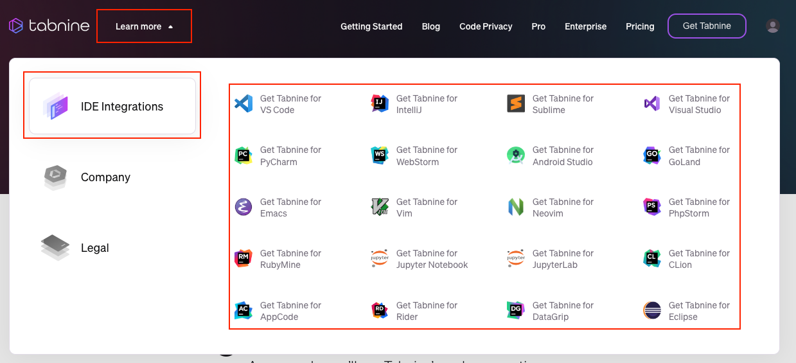

# Tabnine

[Back to Home](../README.md)

### Giới thiệu
Tabnine là một công cụ được phát triển dựa trên các thuật toán học sâu (Deep Learning), với dữ liệu đào tạo được lấy từ hơn hai triệu tệp từ mã nguồn trên Github.

Hiện tại thì plugin Tabnine hỗ trợ khoảng hơn ba mươi ngôn ngữ lập trình khác nhau.

Công cụ này sử dụng AI để tự động hoàn thành mã code. Khi bạn bắt đầu gõ một đoạn code, nó sẽ đề xuất các khối mã hoàn chỉnh hoặc phương thức dựa trên ngữ cảnh. Điều này giúp tiết kiệm thời gian và giảm bớt lỗi cú pháp.

### Cài đặt
#### [Hướng dẫn cài đặt các plugin trên IDE, Text Editor](../install-plugins-instruct)
Để cài đặt Tabnine trên các công cụ Text Editor, IDE. 

1. Vào trang chủ <a href="https://www.tabnine.com/">Tabnine</a> 
2. Click vào `Learn more` &#8594; chọn `IDE Integration` &#8594; chọn Text Editor, IDE mình đang sử dụng và làm theo hướng dẫn để cài dặt 
   
3. Sau khi cài đặt, có thể vào <a href="https://www.tabnine.com/getting-started">Getting Started | Tabnine</a> hoặc 
    có thể xem các video <a target="_blank" href="https://www.youtube.com/@Codota-Tabnine">Tabnine - Youtube</a>
    để xem cách sử dụng nhé 😄.

[Back to Home](../README.md)
